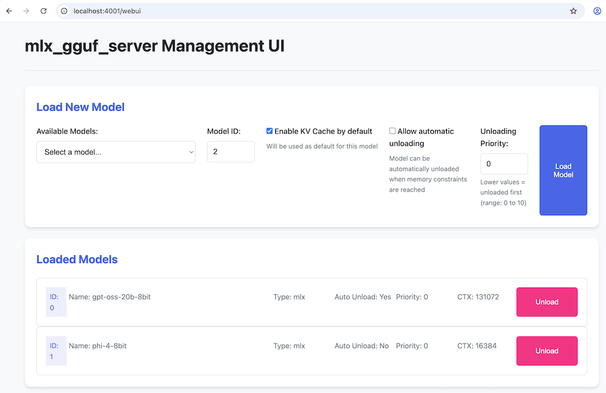

# WebUI Documentation for mlx_gguf_server

## Overview

The mlx_gguf_server WebUI has a simple graphical interface. It allows you to load, unload, and monitor multiple models without needing to use command-line tools or write API requests manually.



## Accessing the WebUI

1. Start the mlx_gguf_server:
   ```
   python main.py
   ```

2. Open your web browser and navigate to:
   ```
   http://localhost:4000/webui
   ```

## Main Interface Components

### 1. "Load New Model" Section
- **Available Models Dropdown**: Shows all models found in your `models` directory
- **Model ID Field**: Assign a unique ID (0-9) to the model instance
- **Configuration Options**:
  - *Enable KV Cache*: Improves chat response times by caching previous computations
  - *Allow automatic unloading*: Enables the model to be automatically unloaded when memory constraints are reached
  - *Unloading Priority*: Sets priority for unloading (lower numbers = unloaded first)
- **Load Model Button**: Loads the selected model with the specified configuration

### 2. "Loaded Models" Section
Displays all currently loaded models in a compact 6-column layout:

| Column | Description |
|--------|-------------|
| ID | The model instance ID you assigned |
| Name | The model's filename or directory name |
| Type | Format type (mlx or llama-cpp) |
| Auto | Whether automatic unloading is enabled (✓ = yes, ✗ = no) |
| Prio | Unloading priority value |
| CTX | Model's context length |
| Action | "Unload" button to remove the model from memory |

## Notes

- The server must be running with the `--max-memory-gb` parameter for auto-unloading to work. (See [AUTO_UNLOAD.md](AUTO_UNLOAD.md))
- Model information updates automatically every 10 seconds